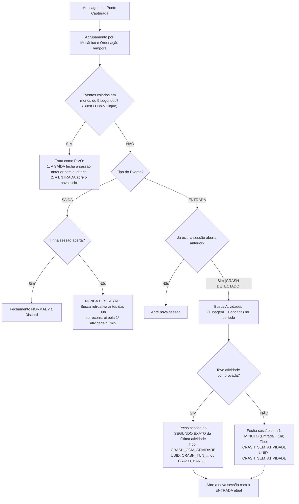

# Documentação Técnica e Funcional: Sistema de Pareamento Inteligente de Pontos (RED'S / `pc_1`)

---

## 1. Visão Geral e Propósito

Esta solução foi projetada para resolver de forma definitiva os problemas crônicos de pareamento de ponto em servidores de GTA RP / FiveM integrados ao Discord. O sistema opera em **paralelo** utilizando a tabela isolada `pc_1`, sem impactar as tabelas legadas ou o funcionamento atual do site.

### O Problema que Existia no Modelo Tradicional:
1. **Mensagens Fora de Ordem no Discord:** Devido a latências assimétricas e chamadas assíncronas de webhooks do FiveM, mensagens de entrada e saída batidas no mesmo instante chegavam invertidas no Discord (ex: entrada gravada 49 milissegundos antes da saída).
2. **Duplo Clique / Lag de Menu:** Jogadores clicavam duas vezes no menu in-game para sair e entrar de serviço (relog / renovação de ponto), gerando micro-rajadas de eventos que quebravam pareamentos ingênuos.
3. **Crashes e Desconexões (Horas Fantasmas):** Quando um mecânico crashava sem bater saída, ele acumulava horas indevidas se o sistema apenas esperasse um fechamento posterior, ou perdia todo o tempo trabalhado se o sistema simplesmente descartasse a sessão.

---

## 2. As Âncoras da Verdade (Ground Truth)

Para não depender exclusivamente da ordem ou confiabilidade dos logs de texto do Discord, o algoritmo utiliza **fontes de dados complementares como prova material de trabalho**:

| Fonte | Tabela | Papel no Algoritmo |
| :--- | :--- | :--- |
| **Ponto (Discord)** | `discord_log_messages` | Detecta os momentos de intenção de início e fim (`ENTRADA` e `SAÍDA`). |
| **Tunagem de Veículos** | `logs_tunagem_reds` | **Âncora 1:** Prova incontestável de que o mecânico estava ativo e trabalhando no segundo exato registrado. |
| **Bancada / Craft** | `log_bancada_reds` | **Âncora 2:** Prova incontestável de trabalho com montagem de peças/ferramentas. |
| **Baú da Oficina** | `log_bau_reds` | **Desconsiderado:** Acessar baú para guardar itens pessoais ou comida não caracteriza serviço mecânico ativo. |

---

## 3. O Ciclo Diário de Operação (09h às 09h)

* **Janela Operacional:** O script analisa os eventos em blocos de 24 horas, iniciando às **09:00:00 da manhã** (horário do reinício diário do servidor FiveM) e terminando às **09:00:00 da manhã seguinte**.
* **Data Civil:** A coluna `data` salva no banco de dados representa a **data civil normal** do dia do calendário em que a entrada ocorreu (horário de Brasília, UTC-3), permitindo relatórios e filtros convencionais no frontend.
* **Teto de Reinício:** Nenhuma sessão ultrapassa o horário de 09:00:00. Caso o servidor reinicie e o ponto continue sem saída, o ponto é encerrado pontualmente no reinício.

---

## 4. As 4 Regras de Ouro do Algoritmo

### Regra 1: Resolução de Duplo Clique como PIVÔ Temporal
Quando um mecânico gera uma `ENTRADA` e uma `SAÍDA` no mesmo instante (diferença $\le 5$ segundos):
1. **Olhando para Trás:** Se ele já tinha um ponto aberto, a `SAÍDA` é processada primeiro para fechar a sessão anterior de forma justa.
2. **Olhando para Frente:** A `ENTRADA` abre imediatamente a próxima sessão de trabalho, garantindo que se ele continuar em serviço, nenhum minuto futuro seja perdido.

### Regra 2: Auditoria Exata em Crashes (`CRASH_COM_ATIVIDADE`)
Se um mecânico abre ponto às `14:00`, não bate saída, e reaparece às `15:00` abrindo outro ponto:
* O sistema varre `logs_tunagem_reds` e `log_bancada_reds` entre 14:00 e 15:00.
* Se a última tunagem dele ocorreu às `14:38:15`, a saída é gravada **exatamente às `14:38:15`**.
* O mecânico recebe os **38 minutos** em que esteve efetivamente na baia trabalhando, e os 22 minutos em que esteve desconectado são eliminados.

### Regra 3: Eliminação de Horas Fantasmas (`CRASH_SEM_ATIVIDADE`)
Se um mecânico abre ponto, sofre crash ou fecha o jogo imediatamente sem realizar nenhuma tunagem nem bancada:
* O sistema detecta a ausência total de registros de atividade.
* A sessão é encerrada com duração de **1 minuto** (`entrada + 1min`).
* Isso impede que usuários "farmem" horas deixando o ponto aberto sem trabalhar.

### Regra 4: Rastreabilidade Absoluta no `uuid_saida`
A coluna `uuid_saida` **nunca fica nula**, funcionando como uma chave primária de auditoria:

| Valor Gravado em `uuid_saida` | Significado | Como Auditar |
| :--- | :--- | :--- |
| `798fef6d-cf62-446f-...` | Saída limpa e legítima pelo Discord | UUID original do bot |
| `CRASH_TUN_fcf80291-dc04-...` | Saída gerada por crash | O código após `CRASH_TUN_` é o UUID do carro tunado na tabela `logs_tunagem_reds` |
| `CRASH_BANC_841530` | Saída gerada por craft | O código após `CRASH_BANC_` é o ID do log em `log_bancada_reds` |
| `CRASH_SEM_ATIVIDADE` | Ponto vazio sem serviço | Sessão de 1 minuto sem atividades comprovadas |
| `REINICIO_09H` | Ponto mantido até o reset | Sessão encerrada no reinício do servidor às 09:00 |

---

## 5. Dicionário de Dados da Tabela `pc_1`

| Coluna | Tipo | Restrição | Descrição |
| :--- | :--- | :--- | :--- |
| `id` | `BIGSERIAL` | `PRIMARY KEY` | Identificador único da sessão |
| `usuario_id` | `INTEGER` | | Passaporte/ID do mecânico no FiveM (ex: `5609`) |
| `nome` | `VARCHAR(255)` | | Nome do personagem / mecânico |
| `data` | `DATE` | `NOT NULL` | Data civil do dia da entrada (fuso de Brasília) |
| `entrada` | `TIMESTAMPTZ` | `NOT NULL` | Horário exato de início da sessão |
| `uuid_entrada` | `TEXT` | `NOT NULL` | UUID da mensagem de entrada no Discord |
| `saida` | `TIMESTAMPTZ` | `NOT NULL` | Horário exato de encerramento da sessão |
| `uuid_saida` | `TEXT` | `NOT NULL` | UUID da saída ou identificador enriquecido (`CRASH_...`) |
| `tipo_fechamento` | `VARCHAR(50)` | `NOT NULL` | `'NORMAL'`, `'CRASH_COM_ATIVIDADE'`, `'CRASH_SEM_ATIVIDADE'`, `'REINICIO_09H'` |
| `total_minutos` | `INTEGER` | `NOT NULL` | Duração calculada em minutos inteiros |
| `total_segundos` | `INTEGER` | `NOT NULL` | Duração calculada em segundos exatos |
| `qtd_tunagens` | `INTEGER` | `DEFAULT 0` | Número de tunagens realizadas durante esta sessão |
| `qtd_bancada` | `INTEGER` | `DEFAULT 0` | Número de crafts de bancada durante esta sessão |
| `total_atividades`| `INTEGER` | `DEFAULT 0` | Soma (`qtd_tunagens + qtd_bancada`) |
| `ultima_atividade_em` | `TIMESTAMPTZ` | `NULL` | Data e hora da última ação registrada |
| `tipo_ultima_atividade` | `VARCHAR(50)`| `NULL` | `'TUNAGEM'`, `'BANCADA'` ou `NULL` |
| `detalhe_ultima_atividade`| `TEXT` | `NULL` | Veículo, placa e valor ou item da bancada |
| `observacao` | `TEXT` | `NULL` | Resumo amigável em linguagem natural |
| `criado_em` | `TIMESTAMPTZ` | `DEFAULT NOW()` | Carimbo de data/hora do processamento |

---

## 6. Arquivos e Scripts Implementados

1. [`migracoes/recriar_tabela_pc_1.sql`](file:///c:/Users/Garrido/registro-servicos/migracoes/recriar_tabela_pc_1.sql):
   * Script DDL completo executado no Supabase para criar a tabela com índices de performance em `usuario_id`, `data`, `entrada` e `tipo_fechamento`.
2. [`scripts/processar_duas_semanas_pc1.mjs`](file:///c:/Users/Garrido/registro-servicos/scripts/processar_duas_semanas_pc1.mjs):
   * Motor de processamento em lote que itera sobre múltiplos ciclos diários das 09h às 09h e popula a `pc_1`.
3. [`scripts/testar_pareamento_pc1.mjs`](file:///c:/Users/Garrido/registro-servicos/scripts/testar_pareamento_pc1.mjs):
   * Script de ciclo individual com suporte a modo simulação (`dry-run`) e gravação real (`--real`).

---

## 7. Resultados do Teste com Dados Reais (2 Semanas: 31/08 a 14/09)

Ao processar o histórico real de 15 ciclos diários da oficina RED'S Tunershop com a garantia de vínculo de 100% das saídas:
* **511 sessões de ponto formadas** (100% dos eventos processados, zero descartes)
* **356 fechamentos normais (69.7%):** Mecânicos com saídas e entradas vinculadas via Discord ou histórico.
* **83 crashes resgatados com atividade (16.2%):** Funcionários que sofreram crash tiveram seu trabalho reconhecido e registrado até o segundo exato da última ação.
* **70 crashes sem atividade (13.7%):** Sessões vazias e cliques acidentais neutralizados em 1 minuto.
* **2 duplos cliques cancelados (0.4%):** Sessões onde o mecânico bateu ponto e cancelou no mesmo segundo.
